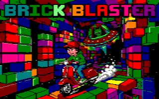

# Brick Blaster - Amstrad CPC Edition

**Brick Blaster** is a high-octane Arkanoid-style arcade game developed for the Amstrad CPC using the [CPCtelera](https://lronaldo.github.io/cpctelera/) framework. It features dynamic gameplay, multiple power-ups, localized content in four languages, and a challenging final boss encounter.



## Features

- **Classic Arcade Action**: Smoothed paddle movement and refined ball physics for an authentic retro feel.
- **10 Challenging Levels**: Including a final boss with custom AI and unique defeat sequence.
- **Dynamic Power-ups**:
  - **L** (Enlarge): Increases paddle size.
  - **S** (Slow): Reduces ball speed.
  - **C** (Catch): Sticky paddle (Space to launch).
  - **P** (Laser): Fire at bricks (Space to shoot).
  - **B** (Extra Life): Directly adds 1 live.
  - **E** (Extra Ball): Spawns 3 balls at once.
  - **A** (Autopilot): Paddle automatically follows the ball for 5 seconds.
  - **F** (Fireball): Ball pierces through destructible bricks without bouncing.
  - **D** (Double Score): Temporarily doubles points gained.
  - **T** (Tiny): Shrinks paddle (Trap).
  - **V** (Velocity): Speeds up the ball (Trap).
  - **G** (Gravity): Increases vertical ball speed (Trap).
  - **I** (Invisibility): Balls and paddle become hard to see (Trap).
  - **U** (Upside Down): Inverts controls (Trap).
- **Autonomous Demo Mode**: Watch the game play itself with fully automated AI-driven paddle and firing.
- **Selectable Difficulty**: Choose between Easy, Normal, and Hard modes to suit your skill level.
- **Multi-language Support**: Fully localized in English, Spanish, French, and Greek.
- **Web Portal Integration**: Includes a web-based emulator to play directly in the browser.

## Controls

| Key | Action |
| :--- | :--- |
| **O / Arrow Left** | Move Left |
| **P / Arrow Right** | Move Right |
| **SPACE** | Launch Ball / Fire Laser |
| **ESC** | Pause / Back to Menu |
| **M** | Toggle Music |
| **0** | Enter Autonomous Demo Mode (from Menu) |
| **3** | Cycle Difficulty Levels (from Menu) |
| **H** | View Help / Power-ups |

## How to Build

### Prerequisites
- [CPCtelera](https://lronaldo.github.io/cpctelera/) framework installed.

### Compilation
To build the game for a specific language, use the `LANG` variable:

```bash
# Build Spanish version
make LANG=ES

# Build English version
make LANG=EN

# Build all languages at once
make all_languages
```

The resulting files will be generated in the  directory:
- `brickblaster_[lang].dsk`: Amstrad CPC Disk Image.
- `brickblaster_[lang].cdt`: Amstrad CPC Cassette Image.

**These are the files you can use to play the game on a real Amstrad CPC or on an emulator.**

## Web Portal

The project includes a modern web-based emulator portal located in the `web/` directory. This allows the game to be played directly in any modern web browser.

### Key Web Features:
- **Integrated Emulator**: Powered by Retro Virtual Machine (RVM) web engine.
- **Dynamic Localization**: The web interface supports English, Spanish, French, and Greek. 
- **Automatic Disk Loading**: When a language is selected on the web page, the emulator automatically "inserts" the corresponding localized disk image.
- **Vibrant UI**: Responsive design with CSS animations and localized metadata.

### Running the Web Portal:
The web portal can be run in two ways:
1.  **Direct File Access**: Simply open `web/index.html` in your browser. It works directly via the `file://` protocol because all disk assets are embedded as Base64.
2.  **Local HTTP Server**: You can also use a simple server:
    ```bash
    python3 -m http.server 8000
    ```
    Then navigate to `http://localhost:8000/web/`.

## Project Structure

- `src/`: C source code.
  - `main.c`: Core game logic and engine.
  - `lang_*.c`: Localized strings and definitions.
- `assets/`: Raw assets (sprites, music).
- `tools/`: Python scripts for asset conversion (`img2scr.py`, `gen_sprites.py`).
- `web/`: Files for the web-based emulator portal.
- `dist/`: Generated binaries and disk images.

## Credits

- **Code & GFX**: ISSALIG
- **Music**: ULTRASYD
- **Framework**: Powered by CPCtelera
- **Special Thanks**: The Amstrad CPC development community.

---
*Bye, bye, Martian!* 🕹️
